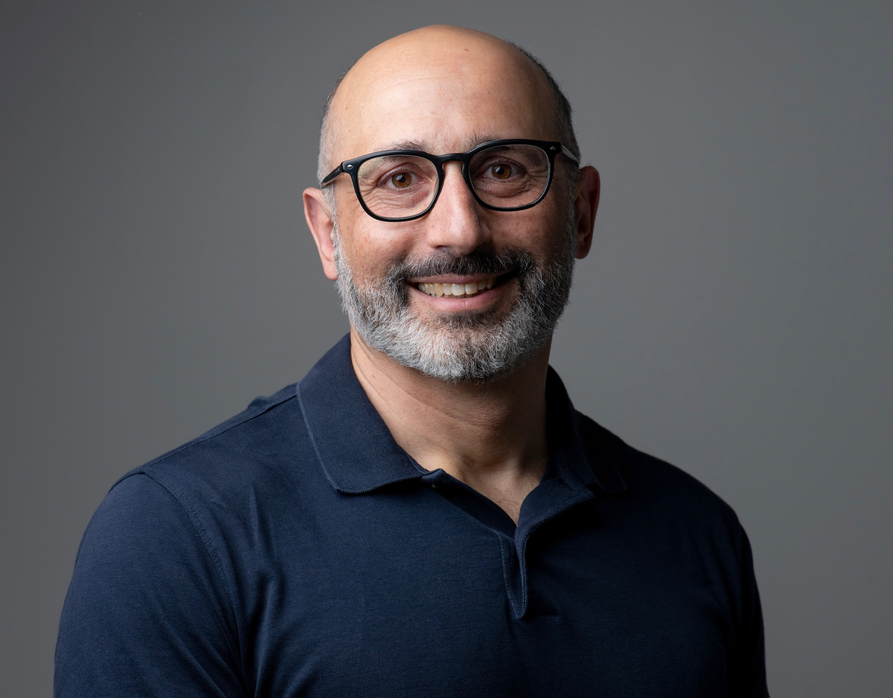

# Adam Oberman 

Professor of Mathematics and Statistics, McGill University · Associate Member, Mila · Research Consultant, LawZero

My research is on AI safety and alignment. Current projects study how to align language models
through their latent representations (latent personality traits, latent adversarial training),
safe-by-design AI systems (Scientist AI, with Yoshua Bengio), and mathematical models of AI risk,
such as human disempowerment through AI advice. This builds on earlier work on the mathematics of
deep learning and on numerical methods for nonlinear PDEs and optimal transport.

[Google Scholar](https://scholar.google.com/citations?user=LPAZlL8AAAAJ) · [CV (PDF)](cv.pdf) · [arXiv](https://arxiv.org/a/oberman_a_1) · email

## Pages
- [Machine Learning/AI Research](research.md)
- [Applied Mathematics Research](research_math.md)
- [google scholar](https://scholar.google.com/citations?user=LPAZlL8AAAAJ&hl=en)
- [Teaching](teaching.md)

## News
- **Sep 2026** — Group grows: welcome Miguel Ayala (postdoc, with Rustum Choksi), Yann Pequignot (research associate),
  Sarath Chingapurathu (RA), and MSc students Michael Alexander and Geoffrey Kelley.
- **2026** — *How Much is Left? LLMs Linearly Encode Their Remaining Output Length* accepted at **NeurIPS 2026** (Amine Merzouk et al.). [arXiv](https://arxiv.org/abs/2607.05316)
- **2026** — *Efficient Safety Alignment of Language Models via Latent Personality Traits* accepted at **COLM 2026**. [arXiv](https://arxiv.org/abs/2607.07918)
- **Aug 2026** — New preprint: *Individual Disempowerment through an Advice Channel*. [arXiv](https://arxiv.org/abs/2608.14795)
- **Jul 2026** — Two new preprints: *Avoiding Unsafe Sets when Training with Langevin Dynamics* and *Fast Rates for Semi-Supervised Learning via Data-Augmentation Graph Regularization*.
- **Jun 2026** — *Safety from Honesty in a Disinterested AI Predictor* (with Yoshua Bengio and the LawZero team). [arXiv](https://arxiv.org/abs/2606.29657)
- **2026** — Area Chair, NeurIPS 2026 and the AAAI 2027 AI Alignment Track.
- **2025** — NeurIPS 2025 **Spotlight**: *Beyond Scalar Rewards: Lexicographic MDPs* (Mehran Shakerinava, Siamak Ravanbakhsh).
- **Jul 2025** — Open Philanthropy research grant for latent adversarial training.
- [Older news](news.html)

## Research Group
**Postdocs and research staff**
- Mohamed Amine Merzouk, Postdoctoral Fellow (2025–)
- Miguel Ayala, Postdoctoral Fellow, co-supervised with Rustum Choksi (2026–)
- Yann Pequignot, Research Associate (2026–)
- Sarath Chingapurathu, Research Assistant (2026–)

**MSc students**
- Michael Alexander
- Geoffrey Kelley (with Jean-Philippe Lessard)

**Undergraduate researchers (2026)**
- Maeve Côté · George Adamopoulos

**Mila research collaborators**
- Mehran Shakerinava (PhD McGill CS, advisor Siamak Ravanbakhsh)
- Michael Rizvi-Martel (PhD, Université de Montréal, advisor Guillaume Rabusseau)
- 

**Alumni (selected placements)**
- Brittany Froese Hamfeldt (PhD) → Professor, NJIT; NSF CAREER Award
- Levon Nurbekyan (postdoc) → faculty, Emory
- Yao Yao (postdoc) → faculty, Georgia Tech
- Yanghong Huang (postdoc) → Lecturer, University of Manchester
- Chris Finlay (PhD, postdoc) → Head Researcher, Deep Render
- Kilian Fatras (postdoc) → Research Scientist, Dreamfold.ai
- Linh Le (postdoc, AI Safety researcher at Lida Safety)
- [Full list](group.html)

**Prospective students and postdocs:** I'm looking for people interested in AI alignment and the mathematics of AI risk. Email me with a CV and a short statement of interest.

## About 

- 2020 Canada CIFAR AI chair, associate member of [Mila](https://mila.quebec/en/mila/team/) 
- Full Professor 2017, faculty at McGill in 2012.
- Simons Fellowship at UCLA in 2017. 
- Faculty at Simon Fraser  University from 2004 to 2012. Postdoc at the University of Texas, at  Austin from 2001-2004.  PhD from  the University of Chicago.

