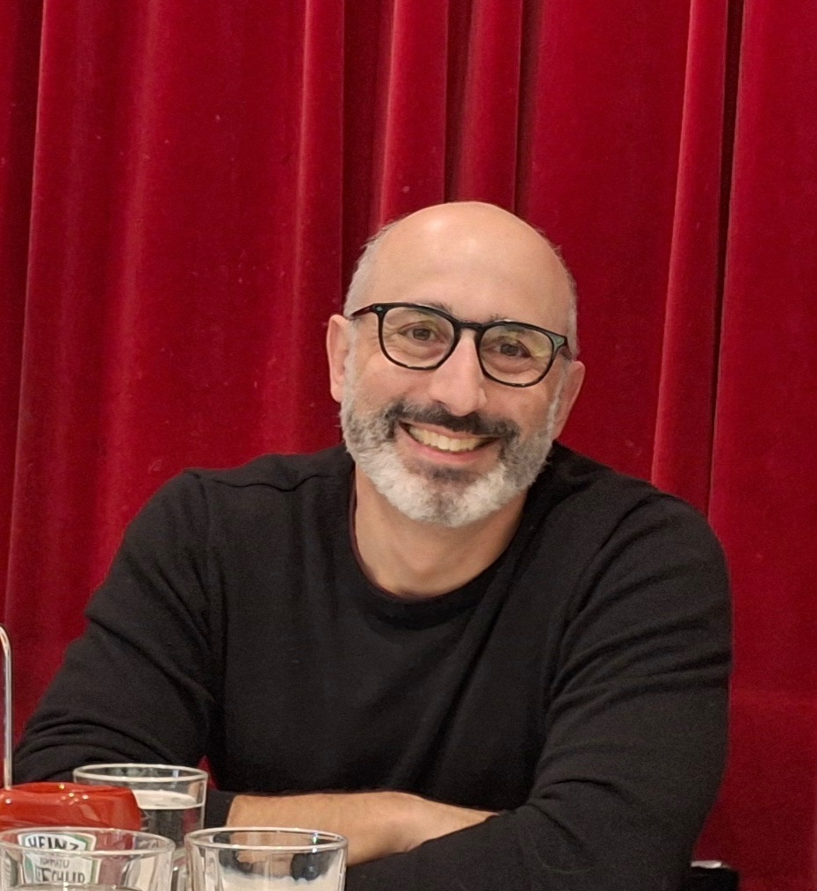

# Adam Oberman McGill Professor

## Pages
- [Machine Learning/AI Research](research.md)
- [Applied Mathematics Research](research_math.md)
- [google scholar](https://scholar.google.com/citations?user=LPAZlL8AAAAJ&hl=en)
- [Teaching](teaching.md)

## News 
- 2025, Open Philanthropy Grant for career transition to AI safety
- 2024, working on AI Safety with [Yoshua Bengio](https://yoshuabengio.org/)

## About 

- 2024 joined Safe AI for Humanity (SAIFH) at Mila
- 2020 Canada CIFAR AI chair, associate member of [Mila](https://mila.quebec/en/mila/team/) 
- Full Professor 2017, faculty at McGill in 2012.
- Simons Fellowship at UCLA in 2017. 
- Faculty at Simon Fraser  University from 2004 to 2012. Postdoc at the University of Texas, at  Austin from 2001-2004.  PhD from  the University of Chicago.

